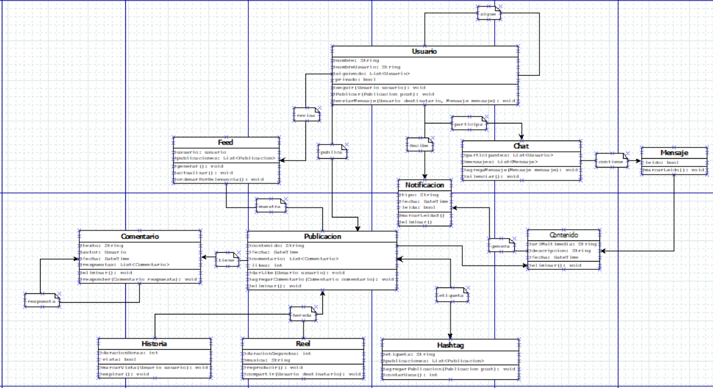

# RiohShots

Taller de abstracción de objetos a partir de una app de uso diario — **Instagram** — para la asignatura de Desarrollo Movil, Facultad de Ingeniería, Universidad de La Guajira (Uniguajira), Riohacha.

## Integrantes

| Código estudiantil | Nombre | Usuario Github |
|---|---|---|
|  | Sebastian David Ramos Jaraba | SantinoDv18 |
| 0002620001 | Carlos Andres Martinez Jauregui | Andreushin |
| 0182310115 | Carlos H. Zarate | DEV-Gordon |

## Descripción del proyecto

RiohShots modela, mediante abstracción y programación orientada a objetos, el funcionamiento interno de Instagram: publicaciones, historias, reels, comentarios, mensajes directos, hashtags, notificaciones y el feed personalizado. El objetivo es identificar las clases, atributos, métodos y relaciones (herencia, asociación, encapsulamiento) que explicarían cómo funciona la app por dentro, sin necesidad de implementarla por completo.

## Estructura del repositorio

- **README.md** — este archivo.
- **docs/** — documentación y diagramas.
  - `taller_abstraccion_riohshots.pdf` — documento final del taller (definición, tabla de clases, justificaciones).
  - `diagrama_uml.png` — diagrama de clases UML (imagen).
  - `diagrama_uml.dia` — diagrama de clases UML editable (Dia).
- **src/** — código fuente.
  - `abstraccion_instagram.dart` — implementación de las clases en Dart.

## Resumen del modelo

**Clases principales:** Usuario, Contenido (abstracta), Publicacion, Historia, Reel, Mensaje, Comentario, Chat, Hashtag, Notificacion, Feed.

**Herencia:**
- `Publicacion` y `Mensaje` heredan de `Contenido` (abstracta) — ambas comparten `urlMultimedia`, `descripcion`, `fecha` y `eliminar()`.
- `Historia` y `Reel` heredan de `Publicacion`.

**Encapsulamiento:** los atributos `_privado`, `_likes`, `_vista`, `_leido` y `_leida` son privados porque representan estados internos que solo deben cambiar a través de un método controlado (`darLike()`, `marcarVista()`, `marcarLeido()`, `marcarLeida()`), evitando modificaciones directas que rompan la coherencia del sistema.

Detalle completo de atributos, métodos, relaciones y justificaciones en [`docs/taller_abstraccion_riohshots.pdf`](docs/taller_abstraccion_riohshots.pdf).

## Diagrama de clases

